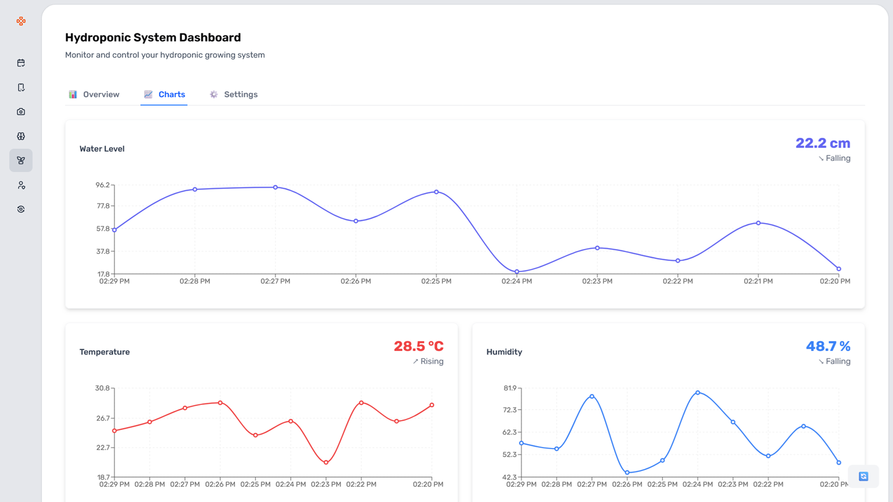
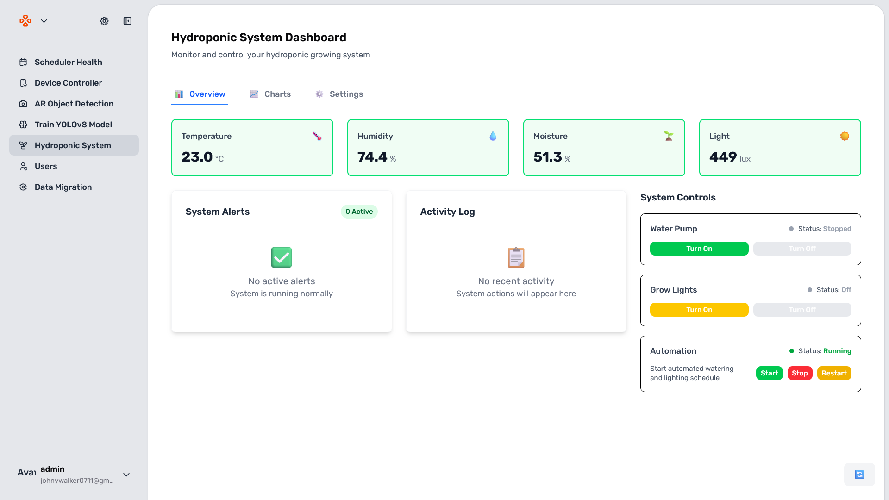

# React + TypeScript + Vite

This template provides a minimal setup to get React working in Vite with HMR and some ESLint rules.

Currently, two official plugins are available:

- [@vitejs/plugin-react](https://github.com/vitejs/vite-plugin-react/blob/main/packages/plugin-react) uses [Babel](https://babeljs.io/) for Fast Refresh
- [@vitejs/plugin-react-swc](https://github.com/vitejs/vite-plugin-react/blob/main/packages/plugin-react-swc) uses [SWC](https://swc.rs/) for Fast Refresh

## Expanding the ESLint configuration

If you are developing a production application, we recommend updating the configuration to enable type-aware lint rules:

```js
export default tseslint.config({
  extends: [
    // Remove ...tseslint.configs.recommended and replace with this
    ...tseslint.configs.recommendedTypeChecked,
    // Alternatively, use this for stricter rules
    ...tseslint.configs.strictTypeChecked,
    // Optionally, add this for stylistic rules
    ...tseslint.configs.stylisticTypeChecked,
  ],
  languageOptions: {
    // other options...
    parserOptions: {
      project: ['./tsconfig.node.json', './tsconfig.app.json'],
      tsconfigRootDir: import.meta.dirname,
    },
  },
})
```

You can also install [eslint-plugin-react-x](https://github.com/Rel1cx/eslint-react/tree/main/packages/plugins/eslint-plugin-react-x) and [eslint-plugin-react-dom](https://github.com/Rel1cx/eslint-react/tree/main/packages/plugins/eslint-plugin-react-dom) for React-specific lint rules:

```js
// eslint.config.js
import reactX from 'eslint-plugin-react-x'
import reactDom from 'eslint-plugin-react-dom'

export default tseslint.config({
  plugins: {
    // Add the react-x and react-dom plugins
    'react-x': reactX,
    'react-dom': reactDom,
  },
  rules: {
    // other rules...
    // Enable its recommended typescript rules
    ...reactX.configs['recommended-typescript'].rules,
    ...reactDom.configs.recommended.rules,
  },
})
```

# Frontend Folder Structure Diagram

```
frontend/
├── 📁 .vercel/                          # Vercel deployment configuration
│   ├── project.json
│   └── README.txt
├── 📁 public/                           # Static assets served directly
├── 📁 src/                              # Main source code directory
│   ├── 📁 api/                          # API layer and HTTP client setup
│   │   ├── client.ts                    # Axios client configuration
│   │   └── 📁 endpoints/                # API endpoint definitions
│   │       ├── deviceApi.ts             # Device management API calls
│   │       ├── deviceStatus.ts          # Device status API calls
│   │       ├── hydroSystemApi.ts        # Hydroponic system API calls
│   │       ├── objectDetectionApi.ts    # Object detection API calls
│   │       └── screen.ts                # Screen capture API calls
│   │
│   ├── 📁 assets/                       # Static assets (images, icons, styles)
│   │   ├── 📁 icons/                    # Icon files
│   │   ├── 📁 images/                   # Image assets
│   │   ├── 📁 lottie/                   # Lottie animation files
│   │   └── 📁 styles/                   # Global stylesheets
│   │
│   ├── 📁 components/                   # React components organized by feature
│   │   ├── 📁 alert/                    # Alert/notification components
│   │   │   └── alert.tsx
│   │   │
│   │   ├── 📁 Announcement/             # Announcement banner components
│   │   │   └── Announcement.tsx
│   │   │
│   │   ├── 📁 ARCamera/                 # Augmented Reality camera components
│   │   │   ├── ARCamera.css
│   │   │   ├── ARCamera.tsx
│   │   │   └── index.ts
│   │   │
│   │   ├── 📁 ARDetectionPage/          # AR object detection page
│   │   │   ├── ARDetectionPage.css
│   │   │   ├── ARDetectionPage.tsx
│   │   │   └── index.ts
│   │   │
│   │   ├── 📁 Auth/                     # Authentication components
│   │   │   ├── EditUserPage.tsx         # User profile editing
│   │   │   ├── LoginModal.tsx           # Login modal dialog
│   │   │   ├── LoginPage.tsx            # Login page
│   │   │   ├── ResetPasswordPage.tsx    # Password reset page
│   │   │   └── SignUpPage.tsx           # User registration page
│   │   │
│   │   ├── 📁 common/                   # Reusable UI components
│   │   │   ├── Badge.tsx                # Badge/tag component
│   │   │   ├── Button.tsx               # Button component
│   │   │   ├── DropdownButton.tsx       # Dropdown button component
│   │   │   ├── EmptyState.tsx           # Empty state placeholder
│   │   │   ├── FileInput.tsx            # File upload input
│   │   │   ├── Form.tsx                 # Form wrapper component
│   │   │   ├── LinearProgress.tsx       # Progress bar component
│   │   │   ├── List.tsx                 # List component
│   │   │   ├── ListLink.tsx             # List item with link
│   │   │   ├── Modal.tsx                # Modal dialog component
│   │   │   ├── ModeToggle.tsx           # Theme/mode toggle
│   │   │   ├── NumberInput.tsx          # Number input component
│   │   │   ├── PageTitle.tsx            # Page title component
│   │   │   ├── PrivateRoute.tsx         # Protected route wrapper
│   │   │   ├── Spinner.tsx              # Loading spinner
│   │   │   └── 📁 dataGrid/             # Data table components
│   │   │       ├── actionButton.tsx     # Action buttons for grid
│   │   │       ├── dataGrid.tsx         # Main data grid component
│   │   │       └── 📁 locale/           # Localization files
│   │   │
│   │   ├── 📁 DevicePage/               # Device management pages
│   │   │   ├── DeviceListDemoPage.tsx   # Demo device list
│   │   │   ├── DeviceListNormalPage.tsx # Normal device list
│   │   │   ├── DevicePage.tsx           # Main device page
│   │   │   ├── index.ts
│   │   │   └── 📁 components/           # Device page sub-components
│   │   │       ├── DeviceConnectedList.tsx    # Connected devices list
│   │   │       ├── DeviceConnectionGuide.tsx  # Connection guide
│   │   │       ├── DeviceInteraction.tsx      # Device interaction controls
│   │   │       ├── DeviceScreen.tsx           # Device screen display
│   │   │       └── DeviceScreenGrid.tsx       # Grid of device screens
│   │   │
│   │   ├── 📁 HydroponicSystemPage/     # Hydroponic system management
│   │   │   ├── HydroponicSystemPage.css
│   │   │   ├── HydroponicSystemPage.tsx
│   │   │   ├── index.ts
│   │   │   └── 📁 components/           # Hydroponic system sub-components
│   │   │       ├── ActivityLog.tsx      # System activity log
│   │   │       ├── AlertsPanel.tsx      # Alerts and notifications
│   │   │       ├── ControlPanel.tsx     # System controls
│   │   │       ├── SensorChart.tsx      # Sensor data visualization
│   │   │       ├── SettingsPanel.tsx    # System settings
│   │   │       └── StatusCard.tsx       # Status display cards
│   │   │
│   │   ├── 📁 layout/                   # Layout components
│   │   │   ├── Footer.tsx               # Page footer
│   │   │   ├── Header.tsx               # Page header
│   │   │   ├── MainLayout.tsx           # Main layout wrapper
│   │   │   ├── MobileTopBar.tsx         # Mobile navigation bar
│   │   │   └── SideMenu.tsx             # Sidebar navigation
│   │   │
│   │   ├── 📁 ModelTraining/            # ML model training interface
│   │   │   ├── ModelTrainingPage.css
│   │   │   ├── ModelTrainingPage.tsx
│   │   │   └── index.ts
│   │   │
│   │   ├── 📁 RoleAssignment/           # User role management
│   │   │   ├── RoleAssignmentForm.tsx
│   │   │   └── index.ts
│   │   │
│   │   ├── 📁 Settings/                 # Application settings
│   │   │   ├── index.ts
│   │   │   └── 📁 components/
│   │   │       ├── AccountTab.tsx       # Account settings tab
│   │   │       └── GeneralTab.tsx       # General settings tab
│   │   │
│   │   └── 📁 UserManagementPage/       # User management interface
│   │       ├── UserManagementPage.tsx
│   │       └── index.ts
│   │
│   ├── 📁 config/                       # Configuration files
│   │   └── constants.ts                 # App configuration constants
│   │
│   ├── 📁 constants/                    # Application constants
│   │   └── constants.ts                 # Global constants
│   │
│   ├── 📁 contexts/                     # React Context providers
│   │   ├── alertContext.tsx             # Alert/notification context
│   │   └── authContext.tsx              # Authentication context
│   │
│   ├── 📁 hooks/                        # Custom React hooks
│   │   ├── useCamera.ts                 # Camera functionality hook
│   │   ├── useDevices.ts                # Device management hook
│   │   ├── useHasAnyRole.ts             # Role checking hook
│   │   ├── useHydroSystem.ts            # Hydroponic system hook
│   │   ├── useScreenStream.ts           # Screen streaming hook
│   │   └── useToggle.ts                 # Toggle state hook
│   │
│   ├── 📁 models/                       # TypeScript type definitions
│   │   ├── 📁 interfaces/               # Interface definitions
│   │   │   ├── Camera.ts                # Camera interfaces
│   │   │   ├── DataGrid.ts              # Data grid interfaces
│   │   │   ├── Device.ts                # Device interfaces
│   │   │   ├── EmptyState.ts            # Empty state interfaces
│   │   │   ├── HydroSystem.ts           # Hydroponic system interfaces
│   │   │   ├── IAnnouncement.ts         # Announcement interfaces
│   │   │   ├── IListItem.ts             # List item interfaces
│   │   │   ├── Modal.ts                 # Modal interfaces
│   │   │   ├── PageTitle.ts             # Page title interfaces
│   │   │   ├── Role.ts                  # Role interfaces
│   │   │   ├── ScreenStream.ts          # Screen stream interfaces
│   │   │   └── User.ts                  # User interfaces
│   │   │
│   │   └── 📁 types/                    # Type definitions
│   │       ├── AnnouncementType.ts      # Announcement types
│   │       ├── ListLinkProps.ts         # List link prop types
│   │       ├── ListType.ts              # List types
│   │       └── ModalType.ts             # Modal types
│   │
│   ├── 📁 services/                     # Business logic services
│   │   ├── authService.ts               # Authentication service
│   │   ├── resetPwService.ts            # Password reset service
│   │   ├── roleService.ts               # Role management service
│   │   └── userService.ts               # User management service
│   │
│   ├── 📁 utils/                        # Utility functions
│   │   └── formatters.ts                # Data formatting utilities
│   │
│   ├── 📁 validation/                   # Form validation schemas
│   │   └── authValidation.ts            # Authentication validation
│   │
│   ├── App.css                          # Main app styles
│   ├── App.tsx                          # Root App component
│   ├── index.css                        # Global styles
│   ├── main.tsx                         # Application entry point
│   ├── routes.ts                        # Route definitions
│   └── vite-env.d.ts                    # Vite environment types
│
├── .gitignore                           # Git ignore rules
├── eslint.config.js                     # ESLint configuration
├── index.html                           # HTML template
├── package.json                         # NPM dependencies and scripts
├── README.md                            # Project documentation
├── start_demo.js                        # Demo startup script
├── tailwind.config.js                   # Tailwind CSS configuration
├── tsconfig.app.json                    # TypeScript app configuration
├── tsconfig.json                        # Main TypeScript configuration
├── tsconfig.node.json                   # TypeScript Node.js configuration
└── vite.config.ts                       # Vite build configuration
```
## UI Overview





## Key Architecture Patterns

### 🏗️ **Component Organization**
- **Feature-based folders**: Components grouped by functionality (Auth, DevicePage, HydroponicSystemPage)
- **Common components**: Reusable UI components in `/common`
- **Layout components**: Navigation and layout structure in `/layout`

### 🔌 **API Layer**
- **Centralized client**: Single Axios configuration in `client.ts`
- **Endpoint separation**: API calls organized by feature in `/endpoints`

### 🎯 **State Management**
- **React Context**: Authentication and alerts managed via Context API
- **Custom hooks**: Business logic encapsulated in custom hooks
- **Services**: Business logic separated into service layers

### 📝 **Type Safety**
- **Interfaces**: Comprehensive TypeScript interfaces for all data structures
- **Types**: Additional type definitions for component props and utilities
- **Validation**: Form validation schemas using Yup

### 🎨 **Styling**
- **Tailwind CSS**: Utility-first CSS framework
- **Component styles**: Feature-specific CSS files alongside components
- **Global styles**: App-wide styles in `index.css` and `App.css`

This structure follows modern React best practices with clear separation of concerns, type safety, and maintainable code organization.